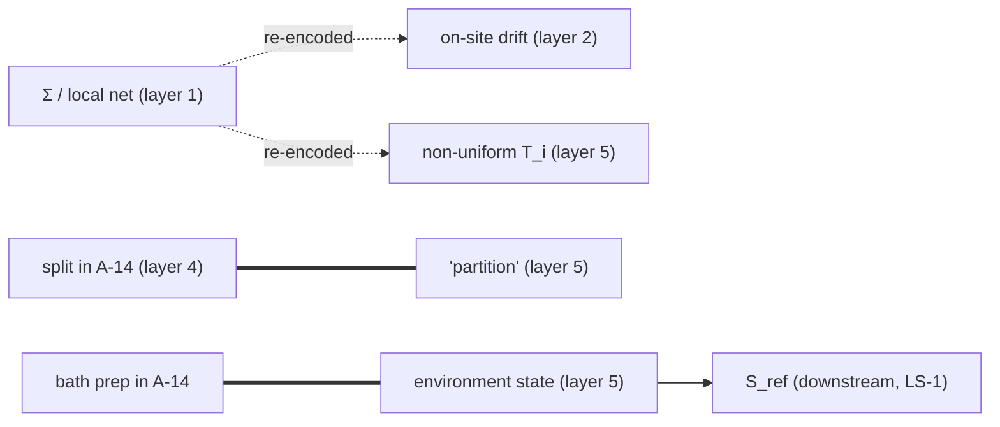
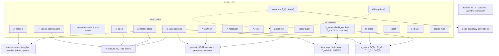

# B4 — NINE-LAYER COMPRESSION MATRIX (pure synthesis; no new numerical physics)

**Inputs (only):**
- the canonical nine layers (`SYN0_OWNER_RULING_01.md` §2);
- Ledger A, A-1 … A-16 (`GRUT_WORKING_THEORY_SYNTHESIS_01.md` §1, read-only at `b935099`);
- reviewed SCOUT-2 (`scout-2-reviewed @ 1f08ae1`);
- the Bridge-1 documents B0, B1, B3 and B2, with correction ledger repairs BR1, BR2 and BR3.

No tenth layer is introduced. The Ledger A entries are finer bookkeeping **inside** the nine layers.

## B4-0 Canonical baseline: the nine layers and their Ledger A entries

| # | canonical supplied layer | Ledger A entries | Bridge sub-items used as matrix rows |
|---|---|---|---|
| 1 | static substrate | A-1 (K, net), A-2 (existence / uniqueness of the net) | 1a K / static coupling · 1b local net |
| 2 | temporal generator, declared nonlinear drift, orientation | A-3, A-12, A-4 | 2a generator class · 2b L0-1c drift · 2c orientation carrier |
| 3 | access / readout interface | A-13 (seed / readout / access sets) | 3a seed · 3b readout · 3c access sets · 3d resolution* · 3e sampling time* · 3f closure* · 3g closure rule* · 3h endogenous access (EA-0) |
| 4 | state / sector / preparation | A-9 (sector), A-10 (statistics), A-14 (initial class, partition, preparation) | 4a sector label · 4b statistics · 4c system marginal · 4d S–B correlations* · 4e epoch* · 4f system–bath split |
| 5 | environment / partition / coarse-graining | A-11 (environment / noise origin), A-15 (coarse-graining); partition (layer name) | 5a environment origin · 5b bath state · 5c noise law (L0-1e) · 5d partition (layer-name listing) · 5e coarse-graining map |
| 6 | physical lift and its prices | A-5 | 6 |
| 7 | ħ | A-6 | 7 |
| 8 | outcome rule | A-7 | 8 |
| 9 | gravitational branch and cosmological transport inputs | A-8 (quadruple incl. universal causal cone), A-16 | 9a gravity quadruple · 9b cosmological transport |

\* **Not booked as a separate Ledger A item.** These are either supplied implicitly (per-campaign declarations, or
inside A-14's "declared initial asymmetry") or downstream (3f). See B4-11.

## B4-1 Residual columns (Bridge-resolved)

| column | reviewed meaning |
|---|---|
| **D** | D_dyn |
| **Σ** | local net / subsystem decomposition / grouping |
| **Hm** | H_marginals |
| **Hx** | H_cross |
| **He** | H_epoch |
| **As** | A_seed |
| **Ar** | A_readout |
| **Ap** | A_partition |
| **Ares** | A_resolution |
| **At** | A_time |
| **Acl** | A_closure = f(D, A_seed; R_closure) |
| **Or** | time orientation |
| **Lor** | Lorentz / causal-cone structure |
| **Out** | outside-SCOUT supplied items |

A_interface := (A_seed, A_readout).

## B4-2 Legend

**Primary classes:**

| code | class |
|---|---|
| **TC** | TRUE COMPRESSION |
| **CC** | CONDITIONAL COMPRESSION |
| **REL** | RELOCATION |
| **RS** | REDUNDANT SUPPLY |
| **CO** | CONSISTENCY / OVERDETERMINATION |
| **REN** | RENAMING |
| **G** | GAUGE |
| **S** | SUPPLIED / NONUNIQUE |
| **BL** | BLOCKED (by Level-0 category or by Bridge scope) |
| **NM** | NO MAPPING |
| **·** | NOT APPLICABLE |

**Qualifiers:**

| code | qualifier |
|---|---|
| [crit] | criterion-priced |
| [rule] | rule-priced |
| [state] | state-priced |
| [acc] | access-priced |
| [lift] | lift-priced |
| [list] | bookkeeping listing only |

Every relevant cell carries exactly one primary class. "·" is used only where no relation exists.

## The matrix

| row | D | Σ | Hm | Hx | He | As | Ar | Ap | Ares | At | Acl | Or | Lor | Out |
|---|---|---|---|---|---|---|---|---|---|---|---|---|---|---|
| **1a** K / static coupling | REN | S | · | · | · | · | · | · | · | · | CC[rule] | · | · | · |
| **1b** local net | · | S | · | · | · | · | · | S | · | · | · | · | · | · |
| **2a** generator class | REN | S | S | S | S | S | S | S | S | S | CC[rule] | S | · | · |
| **2b** L0-1c on-site drift | S | RS | · | · | · | · | · | · | · | · | · | · | · | · |
| **2c** orientation carrier | · | · | · | · | S | · | · | · | · | · | · | S | · | · |
| **3a** access seed | · | S | · | · | · | S | · | · | · | · | CC[rule] | · | · | · |
| **3b** readout | CC[acc] | · | · | · | · | · | S | · | · | · | · | · | · | · |
| **3c** access sets | · | S | · | · | · | · | · | S | · | · | · | · | · | · |
| **3d** resolution / order* | · | · | · | · | · | · | · | · | S | · | · | · | · | · |
| **3e** sampling / horizon* | · | · | · | · | · | · | · | · | · | S | · | · | · | · |
| **3f** closure* | · | · | · | · | · | · | · | · | · | · | CC[rule] | · | · | · |
| **3g** closure rule R_closure* | · | · | · | · | · | · | · | · | · | · | S[rule] | · | · | · |
| **3h** endogenous access (EA-0) | REL[lift] | · | · | · | · | BL[lift] | · | · | · | · | · | · | · | BL |
| **4a** conserved sector label | S | · | · | · | · | · | · | · | · | · | · | · | · | · |
| **4b** statistics | · | · | · | · | · | · | · | · | · | · | · | · | · | BL |
| **4c** system marginal | CC[state] | · | S | · | · | · | · | · | · | · | · | · | · | · |
| **4d** S–B correlations* | · | · | · | S | · | · | · | · | · | · | · | · | · | · |
| **4e** epoch* | · | · | · | · | S | · | · | · | · | · | · | S | · | · |
| **4f** system–bath split | · | S | · | · | · | · | · | S | · | · | · | · | · | · |
| **5a** environment / noise origin | · | · | · | · | · | · | · | · | · | · | · | · | · | NM |
| **5b** bath state (T_b, Gibbs postulate) | CC[state] | · | REL[state] | S | · | · | · | · | · | · | · | · | · | · |
| **5c** noise law Q = 2·diag(T_i) | · | REL | · | REL[state] | · | · | · | · | · | · | · | · | · | · |
| **5d** partition (layer-5 listing) | · | RS[list] | · | · | · | · | · | · | · | · | · | · | · | · |
| **5e** coarse-graining map | · | · | · | · | · | · | · | CC[acc] | · | · | · | · | · | S |
| **6** physical lift and prices | · | · | · | · | · | BL[lift] | · | · | · | · | · | · | · | BL |
| **7** ħ | · | · | · | · | · | · | · | · | · | · | · | · | · | NM |
| **8** outcome rule | · | · | · | · | · | · | · | · | · | · | · | · | · | NM |
| **9a** gravity quadruple (incl. causal cone) | · | · | · | · | · | · | · | · | · | · | · | · | S | NM |
| **9b** cosmological transport | · | · | · | · | · | · | · | · | · | · | · | · | · | NM |

**TC cells: 0** (counted from the matrix, not assumed).

## Cell notes, by layer

### B4-3 Layer 1 — static substrate

**1a × D: REN.** The static coupling is part of D_dyn. "Not derived" in both programs (crosswalk; canonical "earned
static ⇏ unique temporal generator").

**1a × Σ: S.**
- Linear K does **not** reconstruct the net:
  - the tested sparsity optimum has no edges [BR1-02];
  - the chain frames form a continuum, one per cyclic vector [BR1-01];
  - a passive 2D → 1D reading exists;
  - there is an explicit inequivalent isospectral L0-1b net at N = 12.
- Narrow C1-a uniqueness is **CC[crit]** (DLS, a KNOWN-RESULT IMPORT [BR1-03]).

**1b × Σ: S.** The net is the canonical counterpart of SCOUT's Σ (REN in role, with a category difference: classical
direct-sum vs tensor factorization). Its existence and uniqueness are not derived (A-2; EA-0 ruling §3).

**1b × Ap: S.** Access sets presuppose the net, but A ≠ Σ (B3-11).

> **Can layer 1 be compressed into a basis-free K plus a derived net? NO at general earned scope.** It is conditionally
> yes only in the narrow C1-a class (criterion-priced).

### B4-4 Layer 2 — generator / drift / orientation

**2a: REN with D; S against Σ, H and A.** D does not select the net, the preparation or any access component (B1, B2,
B3).

**2a × Acl: CC[rule].** D is a parent of the closure.

**2b × Σ: RS.** The on-site quartic determines the site axes exactly (odeco decomposition). A control written on-site in
another frame recovers that frame instead. So the drift **re-encodes** the supplied net; it does not derive it (R1).

**2c × Or: S.** Orientation is not selected:
- SCOUT D0;
- B2-5 Janus symmetry;
- B2-4 anti-relaxing reversed preparation.

Its **carrier is class-relative.** In the Level-0 G-D class it is the generator's sign (A-4). In the conservative S6
parent it is fixed by the preparation plus **two declared forward notions** [BR3-02]: a temperature-ordering sign for J,
and descent toward the supplied S_ref for D.

**2c × He: S.** The epoch and the orientation are jointly unselected (B2-5).

> **LAYER 2 INTERNALLY DECOMPOSABLE** into {static-coupling-compatible generator class, optional drift, orientation
> carrier}. These are logically independent inputs: the canonical S5 rulings already separate K from the generator class.
> This is **regrouping, not physical compression.**

### B4-5 Layer 3 — access (B3, as repaired)

| rows | class | basis |
|---|---|---|
| 3a, 3b, 3c | S | NOT REDUCIBLE TO D + Σ; completeness ≠ selection; GS1 one-way |
| 3d, 3e | S | order- and threshold-relative; D gives units only |
| 3f | CC[rule] | A_closure = f(D, A_seed; R_closure) |
| 3g | S[rule] | P-5 and P-6 use different closure rules (16 vs 4 on the hidden-sector control) |
| 3h | BL at Level-0 | the auxiliary non-trivial branch = REL into D [lift] |

**3b × D: CC[acc].** State reconstruction given the earned readout is identity-grade (L0 bridge Theorem 1). It is
derived *given* the readout.

> **Does "access" hide a smaller conditional dependency graph? YES:** A_interface ⊕ A_partition ⊕ A_resolution ⊕ A_time
> supplied (A_interface := (A_seed, A_readout)), with the closure downstream of the seed component, D and R_closure.
> **Bookkeeping compression, not layer elimination.** Two of the supplied blocks (3d, 3e) and the rule (3g) are **not
> currently booked** in A-13.

### B4-6 Layer 4 — state / sector / preparation

**4a: S.** Kept distinct from H_corr. The sector *label* is supplied boundary data (A-9; SF-1). The set of possible
sectors is D's invariant structure. SF-1-style sector conditioning is **law-class formation**, not arrow-boundary
preparation. No B2 result touches it.

**4b: BL.** Statistics is lift-adjacent (A-5 price list; A-10). It was not tested by Bridge-1.

**4c × Hm: S; 4c × D: CC[state].** D's absolutely continuous bath forgets H_sys locally (B2-P1), but the integrated record
X_J retains it.

**4d × Hx: S** — the genuine H_corr|Σ core. It is independent and load-bearing: it sets the sign of X_J(∞) at equal T
(B2-1, B2-2). The S6 product preparation is **one member** of this class (REN to SCOUT H_corr|Σ).

**4e: S.** Selected by the preparation form. Up to time translation of a history it is a gauge (B2-5, B2-12).

**4f: S** against Σ and Ap. The retained/bath split is a grouping over Σ, not fixed by K (B1-3). It overlaps A_partition
only by S6's declaration "retained = accessed" (R2).

> **Which parts are genuinely H_corr|Σ?** 4c, 4d and 4e, plus the bath marginal (5b). **4a (sector) and 4b (statistics)
> are not H_corr.** They are ordinary sector / lift labels.

### B4-7 Layer 5 — environment / partition / coarse-graining (overloaded)

**5a: NM.** The physical origin of the noise is unresolved canonically (S2-HB) and untested here.

**5b × Hm: REL[state].** The bath state fixes the local asymptotic state, conditional on the Gibbs postulate and T_b
(LS-1; B2-8). T_b and Gibbs-vs-GGE stay supplied: the GGE family is stationary [BR3-01].

**5b × Hx: S.** The environment does not select H_cross.

**5b × D: CC[state].** The absolutely continuous mechanism compresses memory downstream.

**5c × Σ: REL.** Non-uniform T_i encodes the net (B1-4) (R1).

**5c × Hx: REL[state].** The stationary correlations are fixed by T_i. The initial H_cross is erased, not selected
(B2-10).

**5d × Σ: RS[list].** The same system–bath split is listed both in A-14 (layer 4) and in the layer-5 name (R2).

**5e × Ap: CC[acc].** A_coarse ⊆ A_partition only for fragment-restriction maps (B3). General maps are supplied
(5e × Out: S; A-15).

> **Overlaps are classified; the layer is not eliminated.**

### B4-8 Layers 6–9 firewall

| row | class | basis |
|---|---|---|
| 6 | BL | by Bridge scope |
| 6 × As | BL[lift] | EA-0 auxiliary constructions need a lift |
| 7, 8 | NM | untouched |
| 9a × Lor | S | GRUT explicitly supplies its universal causal-cone / Lorentz structure. SCOUT-2 found Lorentz structure NOT DERIVED / not selected within its premise envelope. The correspondence is convergence on a residual boundary, not a shared derivation [BR5-03]. Not compression |
| 9b | NM | |

**Label overlap noted, not tested.** A-5's price list names "readout identification" and "dilation/bath preparation",
which echo A-13 and A-14. This is recorded as a **related label**, not an established redundancy.

## B4-9 Redundancy graph

| ID | information | where supplied | relation | class |
|---|---|---|---|---|
| **R1** | Σ / local net (site frame) | layer 1 (declared net); layer 2 (on-site L0-1c drift); layer 5 (non-uniform site noise T_i) | **the same information re-encoded** (exact recovery by odeco decomposition or the noise eigenframe; controls select whatever frame each was written in) | **REDUNDANT SUPPLY / CONSISTENCY**, class-scoped: only when the drift is on-site and T_i is non-uniform. Uniform T_i carries nothing. Not a derivation |
| **R2** | system–bath split | A-14 (layer 4) and the layer-5 name "partition" | **identical datum, listed twice** | REDUNDANT SUPPLY [list] (bookkeeping) |
| **R2′** | system–bath split vs Σ vs A_partition | layers 4/5 vs 1 vs 3 | **overlapping, not identical.** The split is one further grouping choice over Σ. A_partition can vary at a fixed split (B3-9), and S6 identifies retained = accessed by declaration | no redundancy claimed |
| **R3** | bath state | S6 preparation (A-14, layer 4) and the environment (layer 5) | **identical datum** in S6 (T_b·Gibbs of the uncoupled bath), listed under both layers | REDUNDANT SUPPLY [list] |
| **R3′** | reference / local asymptotic state S_ref | used as a declared reference in the S6 σ channel; LS-1 proves S₁ → S_ref from the bath state | **downstream**, not duplicate | CONDITIONAL COMPRESSION / RELOCATION into the bath state |
| **R3″** | noise stationary state vs S6 bath | layer 5, different model classes (stochastic L0-1e vs conservative S6) | **related only.** No identification is made (B2-10 firewall) | none |

(Dotted = redundant encoding; double = duplicate listing; arrow = derived.)

## B4-10 Reviewed dependency DAG after Bridge-1

**Non-edges established by Bridge-1:**
- K ↛ Σ;
- D + Σ ↛ A_seed, A_readout, A_partition, A_resolution, A_time;
- D + Σ + A + environment law ↛ H_marginals, H_cross, H_epoch;
- D ↛ orientation;
- geometry ↛ access (GS1 inverse).

The matrix does not contradict the expected graph; it adds the class-relative orientation carrier and the S_ref edge.

## B4-11 Can nine layers be reduced numerically?

**Physical elimination count (from the matrix): TC cells = 0. Supplied information items eliminated: 0.**

**Bookkeeping, counted separately:**

| effect | items | count |
|---|---|---|
| downstream, not to be booked as supplied | A_closure (rule-priced); S_ref (σ-channel reference, downstream of the bath state by LS-1) | 2 (+ already-earned canonical items: geometry given net and access; state reconstruction given readout) |
| duplicate listings mergeable | R2 (split in layers 4 and 5); R3 (bath state in layers 4 and 5) | 2 |
| conditional redundant encodings | R1 (net in on-site drift / non-uniform noise) | 1 (class-scoped) |
| layers internally decomposable | 2 (generator / drift / orientation); 3 (interface / partition / resolution / time + closure downstream); 4 (sector ≠ H_marginals / H_cross / H_epoch / split); 5 (origin / bath state / noise law / partition / coarse map) | 4 layers |
| **hidden supplied / declarative accounting items made explicit** (supplied in practice, not booked as separate Ledger A items; **not all physical primitives** [BR4-01]) | A_resolution, A_time, R_closure, H_cross and H_epoch (inside A-14's "declared initial asymmetry"), Gibbs-vs-GGE postulate | 6 |

**Net reading.**
- The **dependency structure is smaller and cleaner**: 4 removals or merges, plus 1 redundancy edge.
- The **explicit count of supplied / declarative accounting items increases**: the dependency graph resolves into more
  atomic information items (about 6 made explicit, more than the merges remove) [BR4-01].
- These six are **not six new physical primitives**. They are of different kinds: A_resolution and A_time are access / protocol declarations; R_closure is a mathematical convention / rule choice; the absolute coordinate value of H_epoch is gauge under global time translation (the existence of a special-form boundary event is physical); Gibbs-vs-GGE is a supplied state-class / postulate choice; H_cross is genuine physical boundary data.

Keep these distinct: **PHYSICAL COMPRESSION = 0; DEPENDENCY COMPRESSION > 0; EXPLICIT ACCOUNTING-ITEM COUNT ↑;
PHYSICAL PRIMITIVE COUNT CHANGE = NOT ESTABLISHED.** Bridge-1 has refined the ontology / accounting; it has not established
a new count of fundamental primitives.

## B4-13 Bridge verdict category

| category | applies? | basis |
|---|---|---|
| A. CANONICAL PHYSICAL COMPRESSION | **No** | no supplied item became unnecessary |
| B. BOOKKEEPING COMPRESSION ONLY | **Yes** | dependency compression: closure and S_ref downstream; duplicate listings merged; four layers decomposed |
| C. PURE CROSSWALK | **No** | more than renaming occurred |
| D. NEW REDUNDANCY / OVERDETERMINATION | **Yes** | R1, plus duplicate listings R2 / R3 |

## B4-14 Reviewed residual after the matrix

    C5 → D_dyn ⊕ [Σ ⊗ (H_marginals, H_cross, H_epoch)] ⊕ [A_interface ⊕ A_partition ⊕ A_resolution ⊕ A_time]

with D_dyn = (K ⊕ generator class ⊕ class-relative orientation carrier), and:
- A_closure = f(D, A_seed; R_closure) downstream; R_closure a supplied convention;
- the local asymptotic state downstream of the bath part of H_marginals;
- time orientation **not selected**;
- Lorentz / causal-cone structure **supplied** (convergent in both programs);
- lift / ħ / outcome / gravity / cosmology **outside the C5 bridge**.

**Has GRUT changed the SCOUT residual?** Not in size. It changed it in **resolution**:
1. **D_dyn splits** into static coupling ⊕ generator class (the canonical S5 result). SCOUT treated D as one item.
2. **H_corr|Σ** becomes (H_marginals, H_cross, H_epoch), with the bath marginal partly conditionally structured.
3. **A_res** becomes four supplied blocks, with closure downstream (B3).
4. A **redundant re-encoding** of Σ in site-local drift / noise.

## B4-15 Saturation versus B5

TRUE COMPRESSION = 0, so B5 runs as a **formal payoff firewall**, not skipped. Candidate routes it must test:
- **(i) Consistency relations implied by R1.** For example, drift axes = noise eigenframe = net frame: a checkable
  overdetermination. It is a consequence of any site-local model, so it is probably not GRUT-distinctive.
- **(ii) The generalized X_J relation.** It contains supplied preparation data (Q12(0)), so it is **not parameter-free**.
- **(iii) The equal-T offset ½T_b r².** A model-specific harmonic-chain number with K₁₁ = 2.3. It is standard Gaussian
  physics, not a GRUT-distinctive observable.

The expected B5 outcome is NO DISTINCTIVE OBSERVABLE, but it must be tested, not assumed.
