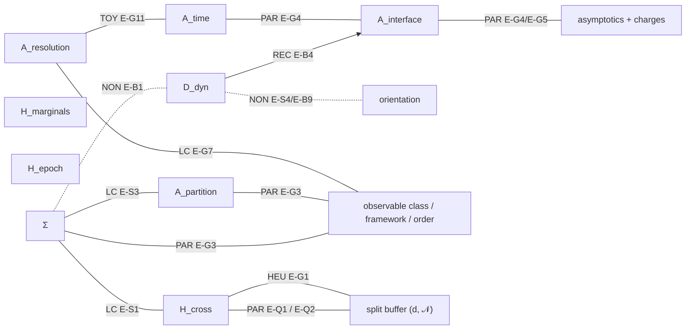

# CONSTRAINT / COUPLING MAP — the surviving residual as a constrained joint class

**Consolidation only. NO NEW PHYSICS.** Every edge below is copied from a frozen result at its frozen grade.

## 1. Starting object

    R  =  D_dyn ⊕ [Σ ⊗ (H_marginals, H_cross, H_epoch)] ⊕ [A_interface ⊕ A_partition ⊕ A_resolution ⊕ A_time]
          A_interface := (A_seed, A_readout)          A_closure = f(D, A_seed; R_closure)   (downstream)

(Bridge-1 final residual [BR2-01, BR2-02]; the reviewed SCOUT residual C5 → D_dyn ⊕ [Σ ⊗ H_corr]_coupled ⊕ A_res, resolved.)

**The residual is a constrained joint class, not a product of independent variables.** An admissible realization is a
tuple (D, Σ, H_m, H_x, H_e, A_int, A_part, A_res, A_time; orientation, dimension, scale, lift, gravitational layer, charge /
asymptotic labels) that satisfies every constraint below. **None of the constraints picks a unique tuple.**

## 2. Edge types (kept distinct)

| type | meaning |
|---|---|
| **LC — logical coupling** | a component is only *defined* relative to another (e.g. H_cross is defined only relative to Σ) |
| **PAR — physical admissibility restriction** | a combination is forbidden in a stated class (theorem- or source-grade) |
| **REC — reconstruction** | one supplied item plus a stated rule generates another (conditional; not compression) |
| **HEU — heuristic restriction** | a combination is excluded under an unproved premise |
| **TOY — illustration only** | a finite or lattice toy shows a mechanism; not a physical constraint |
| **NON — established non-edge** | an expected derivation was shown **not** to hold |

## 3. Edges

### SCOUT-2 (reviewed)

| ID | combination | type | result | grade / source |
|---|---|---|---|---|
| E-S1 | Σ × H_corr | LC | low correlation / freshness / productness are frame-relative. Compatibility must be tested over the complete grouping class | ΣH-0 Prop. 1 (TRUE DERIVATION, scoped); D8; IR-05/E-06 |
| E-S2 | (H, ψ) × CPR-type uniqueness of H's local class → Σ | REC | local TPS uniqueness *given* (k, d, n) and generic couplings; not global | CONDITIONAL DERIVATION + CRITERION-PRICED; E-01 |
| E-S3 | A_res × Σ | LC | A_res is coupled to Σ but not reducible to Σ or D | review accounting §B |
| E-S4 | D × (finite unitary) → orientation | PAR (no-go) | no continuous functional selects an orientation (D0) | D0 TRUE DERIVATION (no-go, scoped); E-03, E-04 |
| E-S5 | D → graph / spectral / causal statistics, invariant measure (rigid D), attractors | REC | conditional on D | CONDITIONAL DERIVATION |

### Bridge-1

| ID | combination | type | result | grade / source |
|---|---|---|---|---|
| E-B1 | K → Σ | NON | K does not determine the net (N = 12 isospectral counterexample) | NO BRIDGE (BI-01) |
| E-B2 | K × (unit-spring Laplacian class C1-a) → Σ | REC | unique in that class | CONDITIONAL COMPRESSION, CRITERION-PRICED (BI-02) [BR1-03] |
| E-B3 | Σ ↔ on-site drift ↔ non-uniform site noise | LC | the net is re-encoded redundantly (R1) | REDUNDANT SUPPLY / CONSISTENCY (BI-03, BI-04) |
| E-B4 | D + A_seed + R_closure → A_closure | REC | closure is downstream; the rule matters (16 vs 4) | CONDITIONAL COMPRESSION [BR2-02] |
| E-B5 | D + Σ → A_seed, A_readout, A_partition, A_resolution, A_time | NON | not derivable | B4-10 non-edges |
| E-B6 | Σ + A_partition + K → geometry | REC (one-way) | GS1 forward only; geometry ↛ access | GS1 ONE-WAY |
| E-B7 | H_marginals + H_cross + K → X_J(∞) | LC (dynamical) | at equal temperature, changing H_cross alone reverses X_J: X(∞) = −⟨E_int⟩_G(½ − α) | B2-P1, BRIDGE-THEOREM REVIEWED AT STATED SCOPE [BR5-02] |
| E-B8 | bath state → S_ref | REC | downstream (LS-1) | CONDITIONAL COMPRESSION / RELOCATION (BI-16) |
| E-B9 | D → orientation | NON | the reversed preparation anti-relaxes; Janus symmetric | NO BRIDGE / CONVENTION (BI-08) [BR3-02] |
| E-B10 | D + Σ + A + environment law → H_marginals, H_cross, H_epoch | NON | not derivable | B4-10 |

### QFT-SCOUT-1

| ID | combination | type | result | grade / source |
|---|---|---|---|---|
| E-Q1 | sharp normal non-type-I factor / commutant localization × H_cross = 0 | **PAR** | **FORBIDDEN** (no normal product state) | G1-P1, an assembly of source-text-verified theorems [Q1R-01 … 06] |
| E-Q2 | split / buffered localization × normal product state | PAR | **ADMISSIBLE IN CLASS, not selected** (arbitrary normal marginals extend) | Summers 2009 Thm. 4.1 [Q1R-06] |
| E-Q3 | non-normal (singular) product extension × sharp pair | PAR | exists only non-normally | Rédei–Summers [Q1R-05] |
| E-Q4 | type III₁ → δ_M : ℝ → Out(M) | REC | injective, state-independent; no representative / time / orientation | conditional specification compression [Q2R-01] |
| E-Q5 | signed HSMI (N ⊂ M, Ω) → positive translation / dilation + ordered half-line family | REC | **CONDITIONAL / LOGICALLY INTERDEFINABLE**; not an interval net automatically; **not TRUE COMPRESSION** | [Q3R-01, Q3R-04] |
| E-Q6 | modular-position pattern → Poincaré / Möbius representation (+ net via BW) | REC | the pattern encodes the geometry type and dimension; the net step partly circular | CONDITIONAL; RELOCATION (GI-07, GI-08) |
| E-Q7 | vacuum + wedge + supplied relativistic structure → modular flow = boost flow (BW) | LC | consistency relation; orientation priced | [Q2R-04] |
| E-Q8 | passivity postulate × dynamics → orientation relative to a state | REC (once imposed) | relocates orientation into the postulate | [Q2R-05] |
| E-Q9 | finite / type-I standard N ⊂ M × half-sided modular inclusion | PAR | proper standard HSMI obstructed in finite dimensions | Lemmas F1, F2 |

### GRAVITY-SCOUT-1

| ID | combination | type | result | grade / source |
|---|---|---|---|---|
| E-G1 | (H_cross = 0, d, R, N, state class) × horizon-free preparation | **HEU** | candidate excluded region d < d\* ~ (N ℓ_P² R)^{1/3}; necessary, not sufficient | PREPARATION-CLASS CONSTRAINT — CONSTRAINED-NONUNIQUE — CONDITIONAL ON L_all — HEURISTIC [GR1-02, GR1-03, GR1-05] |
| E-G2 | fixed-background split inclusion × collar d > 0 | PAR (none) | split-distance infimum 0 under the split assumptions | owner-stated control (Fewster) [GR1-01] |
| E-G3 | subsystem / partition × observable class × gravitational framework / perturbative order | **PAR** | perturbative: charge-labelled gravitational splitting replaces the operational role of 𝒩. Fine-grained (scoped): ordinary split independence **forbidden in class** | **CONSTRAINED / OBSERVABLE-CLASS-PRICED** [GR2-01, GR2-02, GR2-04] |
| E-G4 | finite retarded-time interval × Bondi-charge readout (asymptotically flat) | **PAR** | **FORBIDDEN IN CLASS** (finite-time charge access); A_time itself not constrained | A_time ⊗ A_interface CONSTRAINED-NONUNIQUE [GR3-01, GR3-02] |
| E-G5 | low-energy bulk degree of freedom independent of the specified near-boundary time-band access (AdS) | **PAR** (conditional) | **EXCLUDED** at the verified low-energy / perturbative scope | ACCESS CONSTRAINED — CONDITIONAL ON ACCESS DATA [GR3-04] |
| E-G6 | AdS boundary data (infinitesimal interval) → perturbative bulk state | REC | perturbative holography; consumes the supplied AdS boundary and order | CONSTRAINED + RELOCATION [GR3-02] |
| E-G7 | coarse-grained observable set → approximate split | LC | state-dependent; no gravity-derived rule selects it | COARSE-GRAINING SUPPLIED [GR3-05] |
| E-G8 | exact non-type-I factor / commutant pair supplied by a gravitational setup × H_cross = 0 | PAR | G1-P1 still applies. The crossed-product papers alone do not supply the geometric pairing | [GR1-06, GR2-05] |
| E-G9 | crossed product (Witten II∞; CLPW II₁) → type-I interpolation | NON (not established) | no type-I interpolation established | [GR2-05] |
| E-G10 | charge-dressed pair × charge-indefinite product | **TOY** | product only for charge-sharp interiors (finite caricature) | illustration only [GR2-01] |
| E-G11 | time band ε_t × energy cutoff × robust reconstruction | **TOY** | robust band grows with the cutoff; kinematic, gravity-independent | KINEMATIC ILLUSTRATION [GR3-03] |
| E-G12 | resolution threshold ε (G2 toy) → subsystem algebra | **TOY** | apparent hierarchy; no physical mapping | A_resolution COUPLING CANDIDATE — ILLUSTRATION GRADE [GR2-03, GR3-03] |

## 4. Coupling graph (types marked)

(Solid = an earned coupling or restriction; dotted = an established non-edge; TOY edges are illustrations only.)

## 5. Forbidden-combination list (PAR edges only, theorem- or source-grade)

1. sharp normal non-type-I localization × H_cross = 0 (E-Q1);
2. finite / type-I standard × proper HSMI (E-Q9);
3. fine-grained boundary-complete gravity (scoped) × ordinary QFT split independence (E-G3);
4. asymptotically flat × finite retarded window × Bondi-charge readout (E-G4);
5. AdS low-energy / perturbative scope × a bulk degree of freedom independent of the specified access data (E-G5;
   conditional on access data);
6. finite unitary dynamics × a continuous functional selecting orientation (E-S4, a no-go on selection, not on a member).

**Heuristic exclusion** (not theorem-grade): d < d\* for horizon-free product preparation (E-G1).

**No PAR edge removes every member but one from any component's class.** Each surviving class keeps ≥ 2 members; see
`SELECTOR_CHALLENGE.md` §2 for the frozen witnesses.
