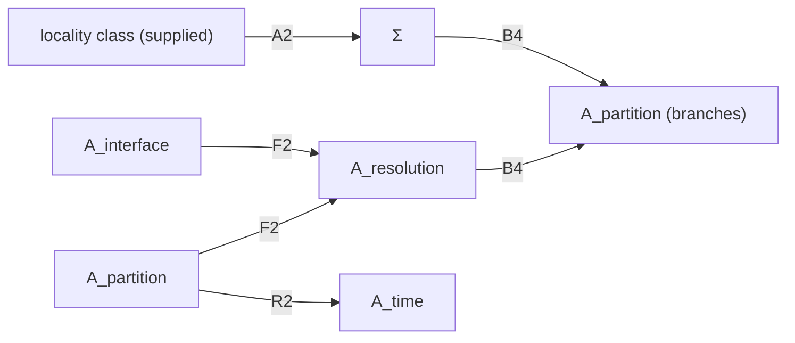

# SURVIVOR DOSSIER — GRUT SELECTOR SCREEN 01

## Survivors

**None.** 0 of 49 candidates was marked SURVIVES PRE-SCREEN, so:
- Stage 5 deep dives: not triggered;
- Stage 6 controlled numerics: **not run**. The charter allows numerics only for a survivor, preregistered here first.
  None was run to lengthen the screen.

## A1 and A5 after SSR1-01 / SSR1-02

- **A1 (Carroll–Singh)** is now graded **PRIMARY / SOURCE-TEXT VERIFIED (owner)**. It has a real Schwinger-Entropy
  minimization algorithm, run over a supplied fixed-dimension factorization class with prescribed candidate states, with no
  global uniqueness theorem. It remains **KILLED — S1** at the frozen Σ scope, as conditional selection within a supplied
  class. Adil et al. is supporting evidence only.
- **A5 (minimal scrambling)** is now **KILLED — S5**: the optimization runs over a supplied family of operationally
  admissible algebras / partitions (A_interface / A_partition).

## Adversarial re-check of the six closest calls (guarding against over-killing)

The screen should prefer decisive falsification, but it also must not kill a real candidate on a technicality. The six
candidates with the strongest uniqueness theorems or claims were re-examined, each against its single best defence.

| near-miss | strongest defence | why the kill stands | would a repaired version survive? |
|---|---|---|---|
| **A2 CPR "locality from the spectrum"** | a genuine theorem: generic uniqueness from spectrum + k-locality, where k-locality is a *class*, not a named factorization, so arguably "less information" than Σ | (i) the frozen record already books "H is k-local" as a supplied canonical item (BI-09 RENAMING; E-01 criterion-priced), so it is not new elimination; (ii) on the frozen isospectral twin W-Σ1 it cannot choose; (iii) genericity is a measure statement (measure-priced) and cannot act on a twin given in advance | **No.** Dropping k-locality leaves A3 (killed by the twin). Keeping it is the frozen conditional derivation E-S2 |
| **F2 causal states / Shalizi–Moore macrostates** | a theorem-grade *unique* minimal maximally predictive partition | unique **given the observable channel**, which is A_interface + A_partition. Two readouts of the same microdynamics give two partitions | **No.** It is a class-C reconstruction (like A_closure), the best possible downstream bookkeeping, but it is relocation |
| **B4 Riedel records** | "a maximum length scale for records is enough to guarantee uniqueness" | exact scope [SSR1-04]: records can induce a preferred branch decomposition *assuming* the spatial-locality tensor structure, and a maximum record length is *sufficient* for uniqueness. The paper derives neither: the length scale is an A_resolution datum and the spatial TPS is Σ | **No.** It turns A_resolution into the selector |
| **L1 LQC dynamical initial conditions** (strongest state-selection near-miss) | Bojowald 2001: one discrete evolution equation supplies dynamics **and** initial conditions; with large-volume semiclassicality a unique wavefunction is predicted. Not an externally imposed boundary proposal | [SSR1-03] the semiclassical / pre-classical admissibility condition remains load-bearing; the quantization is not unique; ordering / discretization choices matter; Cartin–Khanna's Bianchi I quantization leaves only the zero solution; a 2023 polymer analysis (owner-cited) reports an infinite-dimensional ambiguity space capable of discretionary dynamics | **Not without a new supplied quantization rule.** That would be primitive substitution (Stage 7). This is the most interesting failure: it shows a law *can* carry boundary information, but here only via supplied quantization choices |
| **R1 string-gas three dimensions** | a dynamical mechanism with a numerical output (3) | "maximum" (≤ 3) from a thermal fluctuation; "preferred" only "if the string coupling is sufficiently large"; the total dimension (10) is supplied; the authors call for study of "the likelihood of the assumptions" | **No.** Coupling regime + initial-state statistics are load-bearing (S5), and it does not touch the frozen dimension notions (local factor / pattern) |
| **K6 Janus point** | dynamics alone yields a special epoch in almost every solution | orientation: **two** arrows (nonselecting). Epoch: fixed only given the solution (state), with E = L = 0 and a chosen complexity function. Zeh: a selection condition is needed | **No** for orientation. **No** for H_epoch, because the frozen witness W-He is "which special-form preparation", which remains the solution choice |

## Stage 7 meta-test (applied to every near-miss)

*If the principle is simply declared as a new fundamental law, has GRUT explained the target, or replaced target X with a
new primitive law P?*

| near-miss | P | is P independently required? | verdict |
|---|---|---|---|
| A2 | "H is k-local" | already a canonical supplied item | **NEW SUPPLIED SELECTOR** (more precisely, an existing supplied selector, renamed) |
| F2 | "observe through channel 𝒪" | 𝒪 is A_interface | **NEW SUPPLIED SELECTOR** (relocation) |
| B4 | "records have length ≤ ℓ" | ℓ is A_resolution | **NEW SUPPLIED SELECTOR** |
| L1 | "quantize with ordering O and demand pre-classicality" | no independent requirement known that fixes O, and Bianchi I fails | **NEW SUPPLIED SELECTOR** |
| R1 | "string theory at large coupling from a thermal start" | the coupling regime is not fixed by the framework | **NEW SUPPLIED SELECTOR** |
| K6 | "E = L = 0 Newtonian universe; complexity function" | restrictions chosen | **NEW SUPPLIED SELECTOR** (and nonselecting for orientation) |

**No genuine candidate compression was identified.**

## Stage 8 cross-target test (applied to the near-misses)

Several near-misses act on more than one coupled residual entry. In every case they do so **by consuming another entry of
the same coupled cluster**:

| near-miss | entries it would fix | entries it consumes | net |
|---|---|---|---|
| F2 | A_resolution (history coarse-graining) | A_interface, A_partition | moves selection within the access cluster |
| B4 | A_partition (branches) | Σ, A_resolution | moves selection within the Σ / access cluster |
| A2 | Σ | the locality class (canonical supplied criterion) | renaming |
| J1 (QES, killed) | bulk partition / geometry | boundary partition, state | the GS1-type one-way map |
| R2 (Page–Wootters, killed) | A_time | the clock partition (A_partition) | moves A_time into A_partition |

**Every cross-target arrow starts at a supplied entry of the same coupled residual.** This is the selector-side image of the
frozen finding that gravity / QFT *couple* residual entries rather than remove them.
